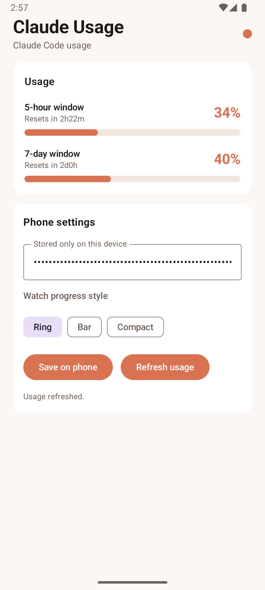
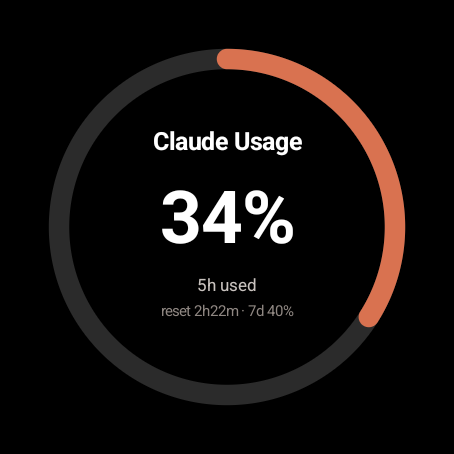
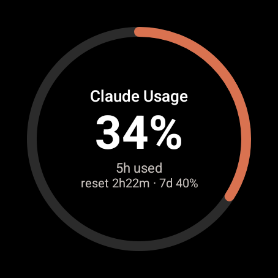

# Claude Usage Companion

Android + Wear OS companion for monitoring Claude Code usage from a phone.

The phone stores the OAuth token locally, refreshes Claude usage directly, and syncs a usage snapshot to Wear OS through the Wear Data Layer. The watch never owns the OAuth token.

## Screenshots

| Phone app | Wear app | Wear Tile |
| --- | --- | --- |
|  |  |  |

## Features

- Phone-first OAuth setup.
- Direct usage refresh from the phone, independent of a desktop computer.
- Automatic usage refresh on app launch when a token is saved.
- Manual refresh button for immediate updates.
- Two Material-style phone progress bars:
  - 5-hour usage window.
  - 7-day usage window.
- Reset countdown labels for both windows.
- Wear OS companion app with selectable display styles:
  - Ring.
  - Bar.
  - Compact.
- Wear OS Tile support for glanceable usage status.
- Android home-screen widget.

## How Usage Is Read

The phone makes a lightweight Claude API request using the saved OAuth token and reads the Claude usage headers from the response. The app stores only the latest usage snapshot for UI, widget, and Wear sync.

The OAuth token is stored only on the phone. It is not sent to the watch.

## Run On Emulators

Start one Android phone emulator and one Wear OS emulator, then run:

```bash
./gradlew runPhoneDebug
./gradlew runWearDebug
```

The run tasks auto-detect a phone emulator and a Wear emulator. To override the target device:

```bash
./gradlew runPhoneDebug -PphoneSerial=emulator-5554
./gradlew runWearDebug -PwearSerial=emulator-5556
```

You can also use the shared Android Studio run configurations:

- `Phone Emulator`
- `Wear Emulator`

## Build

```bash
./gradlew assembleDebug
```

## Project Structure

- `app/` - Android phone app and home-screen widget.
- `wear/` - Wear OS app and Tile service.
- `docs/images/` - README screenshots.

## Notes

- The app is an unofficial companion and is not affiliated with Anthropic.
- Wear Tiles currently use the legacy `androidx.wear.tiles` builders, which compile with deprecation warnings. A future cleanup can migrate the Tile implementation to ProtoLayout Material components.
- Usage availability depends on Claude's OAuth/API response headers.
